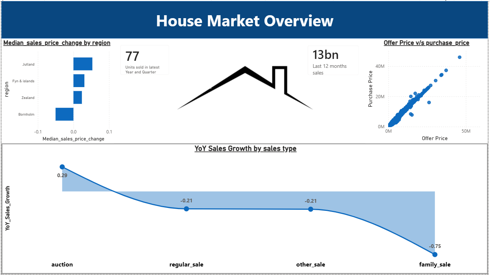
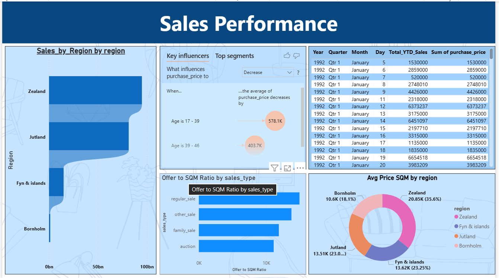

# Housing Market Analysis Dashboard

An interactive Power BI dashboard tracking housing market dynamics, regional performance, pricing behaviors, and key valuation drivers across Denmark regions (Zealand, Jutland, Fyn & Islands, and Bornholm).

---

## Dashboard Overview

### 1. House Market Overview

* **KPI Metrics:** Tracks units sold in the latest period alongside cumulative 12-month sales figures.
* **Median Sales Price Change by Region:** Horizontal bar chart displaying price percentage movements across Jutland, Fyn & Islands, Zealand, and Bornholm.
* **Offer Price vs. Purchase Price:** Scatter plot measuring asking prices against final settlement prices to identify market negotiation gaps.
* **YoY Sales Growth by Sales Type:** Trend analysis tracking year-over-year growth across different transaction categories (Auction, Regular Sale, Other Sale, Family Sale).

---

### 2. Sales Performance & Valuation Drivers

* **Regional Sales Volume:** Funnel visual analyzing overall sales volume dominance by region.
* **Key Influencers AI Visual:** Machine-learning powered visual highlighting key factors that influence purchase price decreases (e.g., property age brackets).
* **Offer to SQM Ratio by Sales Type:** Evaluates listing offer relative to property size across different sale types.
* **Average Price per SQM by Region:** Donut chart detailing price per square meter distribution across Zealand, Fyn & Islands, Jutland, and Bornholm.
* **Detailed Sales Ledger:** Granular tabular view displaying date hierarchies (Year, Quarter, Month, Day) alongside Total YTD Sales and Sum of Purchase Price.

---

## Data Structure

The dashboard processes housing market metrics using the following key variables:

| Category | Key Metrics / Fields |
| :--- | :--- |
| **Geographic** | Region (`Zealand`, `Jutland`, `Fyn & Islands`, `Bornholm`) |
| **Financials** | `Purchase Price`, `Offer Price`, `Median Sales Price Change`, `Offer to SQM Ratio`, `Avg Price SQM` |
| **Sales Metrics** | `Total YTD Sales`, `Units Sold`, `YoY Sales Growth` |
| **Classifications**| `Sales Type` (`regular_sale`, `family_sale`, `auction`, `other_sale`), Property `Age` |

---

